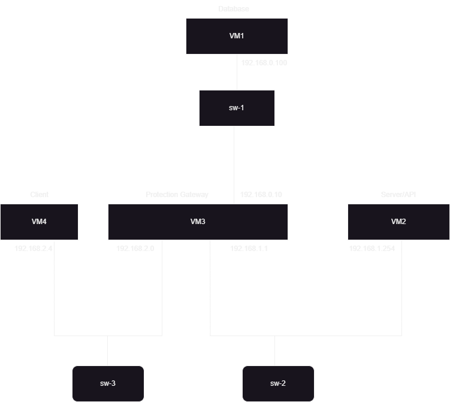
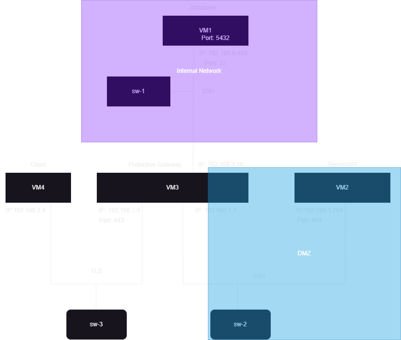

# A35 BombAppetit Project Report

## 1. Introduction

BombAppetit is a web application tailored to enhance the dining experience. It simplifies restaurant reservations with an intuitive interface. Users can explore a curated list of local restaurants based on their location, making it easy to find the perfect dining spot.
BombAppetit facilitates table reservations for any group size.
The system integrates with a discount card service, allowing patrons to redeem their accumulated points for attractive booking discounts. 
BombAppetit revolutionizes dining convenience, connecting users with delightful culinary experiences.

The core data handled by the application is exemplified next:

```json
{
  "owner": "Maria Silva",
  "restaurant": "Dona Maria",
  "address": "Rua da Glória, 22, Lisboa",
  "genre": ["Portuguese", "Traditional"],
  "menu": [
    {
      "itemName": "House Steak",
      "category": "Meat",
      "description": "A succulent sirloin grilled steak.",
      "price": 24.99,
      "currency": "EUR"
    },
    {
      "itemName": "Sardines",
      "category": "Fish",
      "description": "A Portuguese staple, accompanied by potatoes and salad.",
      "price": 21.99,
      "currency": "EUR"
    },
    {
      "itemName": "Mushroom Risotto",
      "category": "Vegetarian",
      "description": "Creamy Arborio rice cooked with assorted mushrooms and Parmesan cheese.",
      "price": 16.99,
      "currency": "EUR"
    }
  ],
  "mealVouchers": [{
      "code": "VOUCHER123",
      "description": "Redeem this code for a 20% discount in the meal. Drinks not included."
  }],
  "reviews": [{ 
    "review": {
      "content": {
        "json":{
          "username": "user_example",
          "score": "6",
          "comment": "Good Enougth" 
        }
      } 
    }
  }]
}

```


### Protection Needs

The protected document must ensure the _authenticity_ of the restaurant data.
If a voucher exists, it should be _confidential_ so that only the user should be able to access it.  
You can assume that the user and the service share their respective public keys.


## 2. Project Development

### 2.1. Secure Document Format

#### 2.1.1. Design

Our library tackles a single secure document format that is flexible for various use-cases, the following is a pseudocode example of the template:
```python
encrypted_document = {
    'content':       str({    
                         'json':                  json_object or str,
                         'timestamp':             seconds in float with microsecond precision,
                         'nonce':                 str,
                         'encrypted_sections':    list,
                         'fully_encrypted':       bool
                     }),
    'encrypted_key': base64(rsa_encrypt(AES_key + AES_IV)), # optional, [+] concatenates
    'signature':     base64(rsa_sign(sha256(content))),
}
```

There are certain variations of it, such as 'json' value being a str if 'fully_encrypted' is True, and 'encrypted_key' being missing if both 'encrypted_sections' is empty and 'fully_encrypted' is False.
The original message is the json_object, the 'content' section also contains metadata for the guarantees below.

##### Confidentiality

In our scenario, confidentiality is required but not for the entire document, the way we proposed is to be able to encrypt chosen sections (or keys) of the json_object, these keys are then stored in the 'encrypted_sections' list. It is still possible to encrypt the entire document, for that we have the 'fully_encrypted' bool that denotes whether json_object is fully encrypted and if so then 'json' becomes a base64 str of the aes_encrypted json_object.

The way the sections are encrypted is by first generating an AES-256 key and IV, converting the contents of the sections to str, encrypting the str, converting it to base64, and finally replacing the section content with the base64 string. The sections are all encrypted sequencially with AES in CBC mode but padded individually, therefore the 'encrypted_sections' is sorted.

Finally, to send the key and IV, they are concatenated, encrypted with the destination's public key, then converted to base64 and stored in the 'encrypted_key' section.
This section is not created if encryption is not used.

##### Freshness

To assure freshness, two methods are used, a timestamp and a nonce(number used once).
They are both stored within the 'content' JSON to benefit from the authenticity and integrity but they are not encrypted.
Timestamp is a float that represents the time (in seconds) that has passed since 1970-01-01 00h00.
Nonce is the str hex of 16 random bytes.
They are both used to optimize the check and fix each other's flaws.

##### Authenticity and Integrity 

To assure integrity, the message (which is the 'content') is first converted to a str and then hashed with SHA256.
To assure authenticity, the digest of the 'content' is signed using the private key of the sender, the algorithm used is PKCS #1 v1.5.
'content' is sent as a str because JSON does not guarantee key order nor whitespace.

##### Data Format

An example file:

```json
{
    "a": 1,
    "b": 1,
    "c": 3,
    "d": 4
}
```

The above file partially encrypted ("a" and "b"), using a 1024 key length for brevity:

```json
{
    "content": "{\"json\": {\"a\": \"mfb+UBzpYsCHDhY9cQJecg==\", \"b\": \"jD1x3PZCctz6MbUvbQPWQQ==\", \"c\": 3, \"d\": 4}, \"timestamp\": 1703003241.958332, \"nonce\": \"e5c9793e3e4bf0f28b962cf693304784\", \"encrypted_sections\": [\"a\", \"b\"], \"fully_encrypted\": false}",
    "encrypted_key": "UUx9CG8EZEsnjnVTPrOiEaKLBCC56jzEn7c9V60oxf1Uln+G21XoUqvt5bOTZ/bt+hvWXKI30sx62ffM8tLKFNXVVN2rnbn6/eGQYCOhIIQjwLXTZjXa7q387bN5bqD/QPiVwh24dcUPPo316HSzJeE40VQYy5azJBsDCY2bBAA=",
    "signature": "SB0yJIyEGulgP84W9cmdJxYQk035oJ3eeuNzEGzhoUpMYliHWnAz+xur5OsD/GrG5VdBk1gLcvwrYyDIT8l5hsENevFApeBBgs5BAgxR0ii4AvbdaTz3Yo/H0jO99NJJt1Nay6CLPxBQ/zWwillrax2gPSe6Y23LZJkcro4TZf4="
}
```

#### 2.1.2. Implementation

The implementation of the secure documents was in python, python 3.11.2, using the [PyCryptodome library](https://pycryptodome.readthedocs.io/en/latest/src/introduction.html).

We first started with simply encrypting the entire document:
```python
{
    "encrypted_content": base64( aes_encrypt(str(json_object)) ),
    "encrypted_key":     base64( rsa_encrypt(AES_key + AES_IV) ), # [+] concatenates
    "encrypted_hash":    base64( rsa_sign   (sha256(content) ) ),
}
```
However, partial encryption was required, so had to change it.

Our next challenge was the nonce, we first used the generated IV. Since it was encrypted and a key section of the decryption there was the integrity guarantee.
However, this was bad because we had to decrypt to test the nonce which was costly, and in the case of an unknown user there was no way to encrypt because the server didn't know the public key.

So, we then generated nonce separate from the IV and stored it in the 'content' section.
The problem with only using nonces is that they don't have any information about how old is the message and they don't scale as they all need stored and checked on every new message.

Then, we swapped to timestamps with a 1 (one) minute leeway, they fix the storing issue and the message date issue, but if a replay is made within that minute there is no way detect the duplicate.

Finally, we used both, with the nonce to guarantee uniqueness and the timestamp to both signal the age and restrict the nonces required to store.

The tool itself has 4 (four) commands:

  1. `generate`: This command has only a single argument, it is the output file name, doing `generate alice.pem` generates a new RSA key pair with 2048 key length and the files `private_alice.pem` and `public_alice.pem` are created
  2. `protect`: This command has 5 (five) arguments. In order, they are the input json, the private key of the sender, the public key of the destination, the output filename, and the sections to encrypt. The sections must be in a valid list format and they must match a key in the first layer of the input json. An example command is `$ python tool.py protect example.json private_alice.pem public_bob.pem out.json '["restaurantInfo"]'`
  3. `check`: This command has 3 (three) arguments. They are the input secure document, the public key of the sender, and the private key of the destination. This works exactly like the unprotect but it catches all exceptions to say it's invalid, or if it works, doesn't store the output and simply outputs that it's valid.
  4. `unprotect`: This command has 3 (three) arguments. They are the input secure document, the public key of the sender, the private key of the destination, and the output json file. To note, this automatically checks if there is any encryption or encrypted sections and restores them, it also automatically checks the freshness by creating a `seen_nonces.json` file and storing the nonces in there, this is how the program "remembers" even after it exits.

### 2.2. Infrastructure

#### 2.2.1. Network and Machine Setup

#### 2.2.1.1 Basic Explanation

The infrastructure relies on four virtual machines, each serving a specific purpose. The initial virtual machine, VM1, hosts the database, specifically a PostgreSQL database in our case. The second virtual machine, VM2, serves as the server, housing the API. We utilized Flask for its development. The third virtual machine operates as a safeguard, primarily securing connections using UFW. It serves as a middleman to all other VMs, rerouting requests between VM2 to VM1 and between VM4 to VM2.

#### 2.2.1.2 Connections Explanation

To explain the connections we provide the following image:



The connections between the VMs are illustrated in the image. VM4 and VM3 are connected via a virtual network using switch sw-3, with IP addresses 192.168.2.4 for VM4 and 192.168.2.0 for VM3. VM2 and VM3 are linked through switch sw-2, utilizing IP addresses 192.168.1.254 for VM2 and 192.168.1.1 for VM3. Similarly, VM1 and VM3 are interconnected via switch sw-1, using IP addresses 192.168.0.100 for VM1 and 192.168.0.10 for VM3.

#### 2.2.1.3 Technologies Explanation

In the virtual machines used, we employed technologies enabling us to achieve the project's goals.

In VM3, where connection security was implemented, we opted for UFW due to its simplicity and ease of configuration.

For the API hosted in VM2, we chose Flask due to its compatibility with Python, the language used in this project. Flask's simplicity, flexibility, and support for REST services made it an ideal choice.

In VM1, where the database is hosted, we selected PostgreSQL for its data integrity, the ability to implement constraints important for RESTful APIs, and its support for JSON.

#### 2.2.2. Server Communication Security

The provided image depicts an enhanced version of the previous diagram, illustrating ports and IPs where VMs can receive communication messages and the secure communication channels implemented:



As seen in the image, both in the DMZ and the internal network, all machines are equipped with firewalls enforcing rules that restrict all connections except those shown. VM1 (the database) allows incoming traffic only when directed to port 22 and originated from the server API (VM2). The server API permits incoming traffic only on port 443, accessible to all. The gateway (VM3) only allows packets destined for the server API (VM2) on port 443 or sent from the server API (VM2) to the database (VM1) on port 22.

Due to issues encountered while setting up rules in a fresh VM, not only were rules defined in VM3 for routing but also without referencing the routing.

Server communications were secured using TLS and SSH.

Between the client (VM4) and the server API (VM3), TLS secures their communications. In VM4, a private key was created and used to generate a certificate. This key and certificate, unverified by a certificate authority, are applied to each registered client. Additionally, keys for decryption, encryption, signing, and verification are generated upon user registration and stored in the keys folder. The public key of the user is sent to the server/API (VM2). The keys folder also contains the public key of the server used for encryption.

Between the server/API (VM2) and the database (VM1), SSH is implemented for secure communications. No certificate is required in this type of communication. As developers of this project, we decided that the server would possess the credentials for the database VM and use this information to create a secure tunnel between their virtual machines.

There was challenges due to the ssh connection between VM1 and VM2 that weren't taken into consideration during the beginning of development of the infrastructure and because of that it took more time when it was created fresh new copies of the kali virtual box to make all firewalls working, principally the firewalls on the VM1 and VM2, that for a reason unknown by us did't let requests from VM2 to enter to vm1 if we specified that the requests were specifically from the VM2 but due to the rule being working on the VM3, the security of the firewall isn´t breached. 

Also the rerouting had it´s fair chair of problems, where they work in the work environment but when created fresh new VM's they stopped working when implemented the firewall created, making us create extra firewall rules on VM3 for in case o rerouting and in case of none rerounting.


### 2.3. Security Challenge

#### 2.3.1. Challenge Overview

Introduce _reviews_ with classification made by users, e.g. 1 to 5 stars and some text.
Reviews should be non-repudiable and other users must be able to verify the authenticity of each review, to ensure credibility and trustworthiness in user feedback.  
Regarding the _vouchers_, each one is tied to a specific user and can only be used once.
Moreover, a new mechanism must be implemented to allow users to directly transfer vouchers to other users of the service.  
Each user still only has its own keys, so, some dynamic key distribution will have to be devised.

#### 2.3.2. Attacker Model

All three servers (the gateway, the database, and the api) are fully trusted, they may be restricted but their identites aren't validated or challenged.

The admin is part of the clients, and on first boot it doesn't exist, so on register it is fully trusted and unchallenged as the server can't verify the admin.

The clients are all partially trusted, their messages' signature beig verified but no challenge-response made.

If the server's admin wasn't set before opening to the public any regular attacker could hijack the service by simply registering with the name "admin".

The database is setup with a default kali account (kali:kali) with an open ssh port, an attacker could hijack the gateway and have easy access to the database.

Since it's assumed the clients previously know the server's public key there is no way for a man in the middle attack, all sensitive data is guaranteed by signed or encrypted RSA.

It is possible to easily DoS the server since every message requires getting the user's key and validating the signature, because there is no rate limiting implemented and it is a costly process, the server will hash the entire content and sign to validate, a flood of random messages with valid usernames and huge content can overwhelm small and slow servers.

#### 2.3.3. Solution Design and Implementation

Because the reviews required authenticity but not confidentiality, a new secure document had to be made, but instead of creating a separate one we rewrote the previous into allowing arbitrary encryption (even none at all). Because of the security challenge, now the decryption allows toggleable freshness checking and missing 'encryption_key's.
This decision was made to simplify the design, a single function call does all, every message has the same template now.

## 3. Conclusion

Reflecting on this project, we've achieved significant milestones:

* Constructed the entire infrastructure for a simple service.
* Maintained and fortified the machines.
* Designed and connected the network layout.
* Secured connections with off-the-shelf solutions.
* Created customized protocols for added restrictions and assurance.
* Validated each message for security.
* While meeting most requirements, some aspects fell short, notably the user experience's simplicity and the server's minimal error handling for multi-user interactions.

The library could benefit from further modularization, splitting functions for better usability. The vouchers and reviews might need separate templates to avoid redundancy and enhance efficiency.

In summary, this project offered valuable experience in system maintenance, architectural design, networking setups, and cryptographic protocols.

----
END OF REPORT
